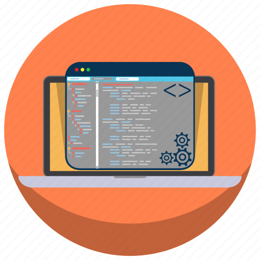

 
<h1 align="center">Hi 👋, I'm Sameer Singhal</h1>
<h3 align="center">Embarking on a Journey: Learning DSA and Development from India and Fueled by a Passion for Problem Solving: A Journey into Competitive Programming and Learning</h3>

  

   
 

  
👨‍🎓 About Me
    <ul>
      <li>I'm a passionate programmer and problem solver, always eager to learn new skills and come up with effective solutions.</li>
      <li>I have an insatiable curiosity for technology and love exploring new areas.</li>
      <li>What sets me apart? I can quickly learn new skills and apply them to solve real-time problems.</li>
      <li>Currently, I'm in my 2nd year of studies.</li>
      <li>I'm currently focused on learning Full Stack Web Development & Advanced Data Structures and Algorithms.</li>
      <li>For fun, I enjoy playing games and listening to music.</li>
      <li>You can reach me via email at: gobindsinghal87@gmail.com.</li>
      <li>Let's connect on LinkedIn: <a href="www.linkedin.com/in/sameer-singhal-0151b4252">LinkedIn Profile</a></li>
    </ul>
  

<h2> 🏆 Achievements </h2>

  
 👉CodingNinja/Studio
    <ul>
      <li>Weekend Contest Rating: 2430+</li>
      <li>Level 8 (Master)</li>
      <li>58000+ EXP gained</li>
      <li>1090+ Problem Solved</li>
      <li>100+ Days of Coding Streak</li>
      <li>Ninja Dominator league</li>
    </ul>
  

  
 👉 CodeChef
    <ul>
      <li>130+ Days of Coding Streak</li>
      <li>360+ Problem Solved</li>
      <li>Highest Rating : 1150</li>
      <li>10 Contest Participated</li>
    </ul>
  

  
 👉 LeetCode
    <ul>
      <li>65+ Days of Coding Streak</li>
      <li>70+ Problem Solved</li>
      <li>Highest Rating : 1442</li>
      <li>1 Contest Participated</li>
    </ul>
  

  
 👉 CodeForces
    <ul>
      <li>63+ Days of Coding Streak</li>
      <li>64+ Problem Solved</li>
      <li>Highest Rating : 368</li>
      <li>1 Contest Participated</li>
    </ul>
  

  
 👉 GeeksForGeeks
    <ul>
      <li>33+ Problem Solved</li>
      <li>86+ Coding Score</li>
      <li>280 Institute Rank</li>
    </ul>
  

  
 👉 HackerRank
    <ul>
      <li>3⭐ Badge in C++</li>
      <li>3⭐ Badge in C</li>
      <li>3⭐ Badge in Java</li>
      <li>230+ Hackos</li>
    </ul>
  

  
Feel free to explore my GitHub for more exciting projects and code!

<h2 align="left">  Connect with me:</h2>

<h2 align="left">  Languages and Tools:</h2>

 

<h2>   My Github Stats</h2>

  

 

 

 

 
 

